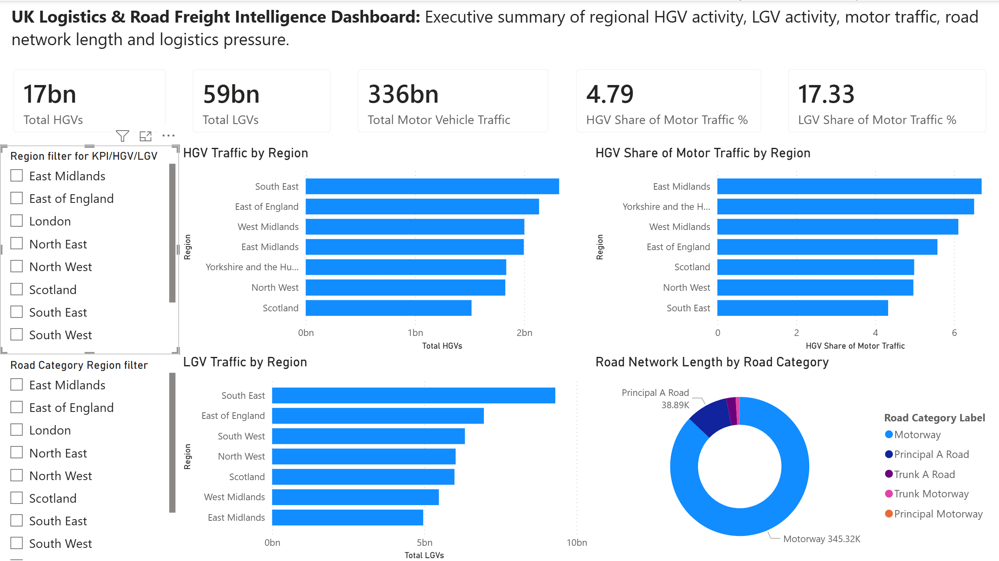
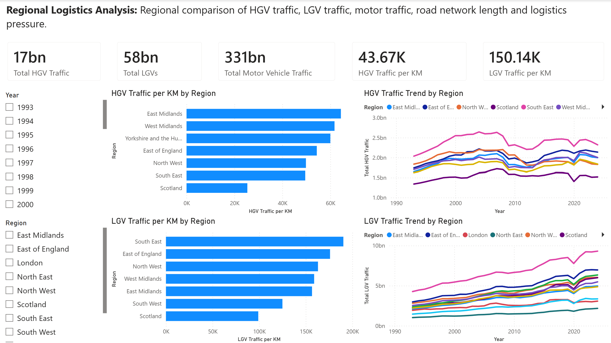
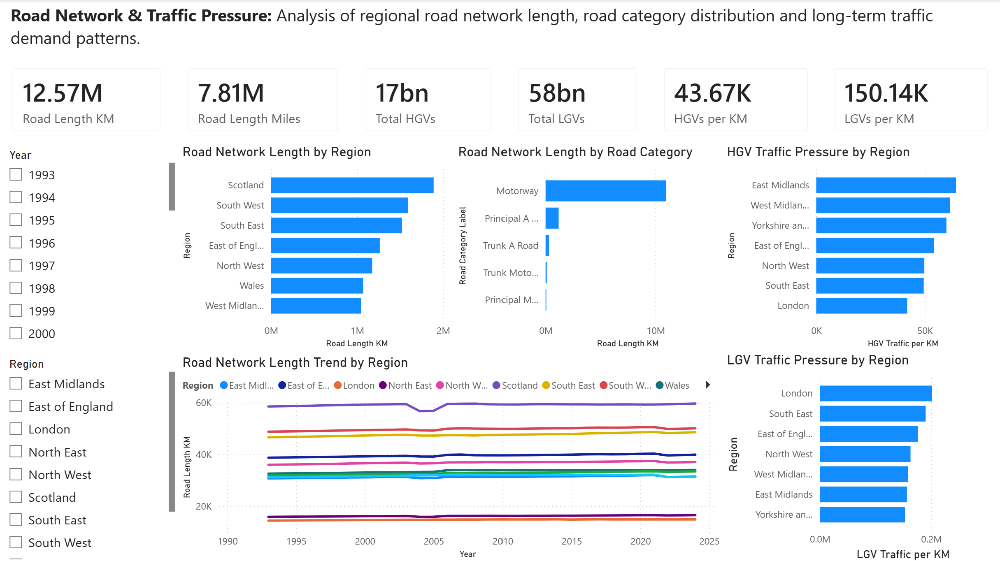

# UK Logistics & Road Freight Intelligence Dashboard

## Dashboard Preview

The Power BI dashboard contains three report pages:

1. Executive Summary
2. Regional Logistics Analysis
3. Road Network & Traffic Pressure

### Executive Summary

This page provides a high-level overview of regional HGV activity, LGV activity, motor traffic, road network length and logistics pressure.

---

### Regional Logistics Analysis

This page compares regional HGV traffic, LGV traffic, motor vehicle traffic, traffic per kilometre and long-term regional traffic trends.

---

### Road Network & Traffic Pressure

This page analyses regional road network length, road category distribution and road traffic pressure patterns.

## Reports

The project includes the following written reports:

| Report                                                          | Purpose                                                                                                  |
| --------------------------------------------------------------- | -------------------------------------------------------------------------------------------------------- |
| [Executive Summary](reports/executive_summary.md)               | Summarises the project purpose, business context, dashboard pages, key analysis areas and business value |
| [Methodology](reports/methodology.md)                           | Explains the end-to-end project approach, from data sourcing through to SQL views and dashboarding       |
| [Business Recommendations](reports/business_recommendations.md) | Converts the analysis into practical logistics, transport and operations recommendations                 |
